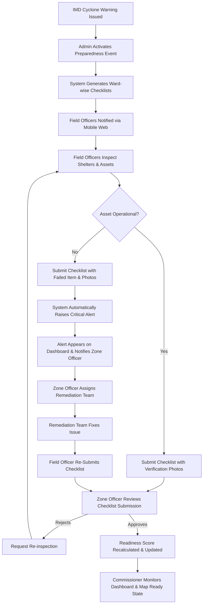
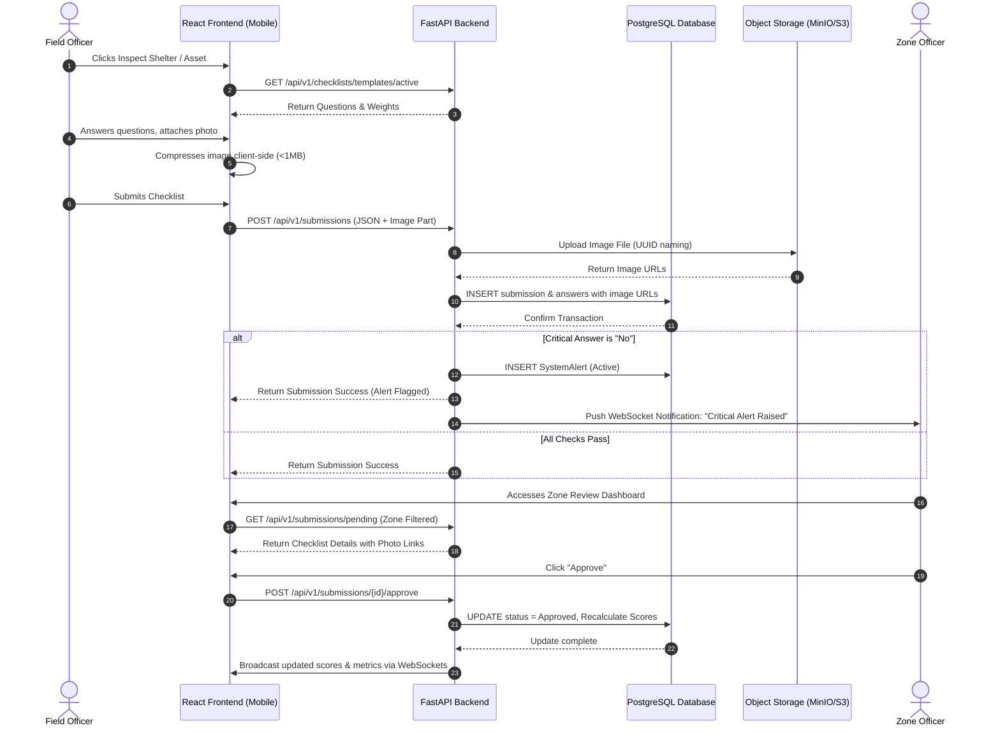

# PROJECT PLAN: Cyclone Preparedness Checklist & Real-Time Asset Readiness Dashboard

**Client:** Greater Visakhapatnam Municipal Corporation (GVMC)  
**Domain:** Disaster Management & Emergency Response  
**Target System:** High-Availability Digital Preparedness and Monitoring System  
**Author:** Senior Software Architect  
**Version:** 1.0.0  
**Date:** July 31, 2026

---

## 1 Executive Summary

### The Business Problem
Visakhapatnam, situated on India's cyclone-prone eastern seaboard, regularly faces severe tropical storms and cyclones (e.g., Cyclone Hudhud in 2014, Cyclone Gulab in 2021). The Greater Visakhapatnam Municipal Corporation (GVMC) coordinates preparedness activities across its 8 administrative zones and 98 wards. However, the current verification of cyclone preparedness is manual, paper-based, and heavily reliant on verbal reporting. 

Critical preparedness gaps—such as non-functional dewatering pumps, unprovisioned relief shelters, dry backup generators, and un-staged rescue teams—are often obscured by slow communication loops. The GVMC Commissioner and Disaster Management Admins have no centralized, real-time dashboard to identify which zones or wards have outstanding safety gaps. This structural delay impedes critical decisions during the crucial 48-hour window preceding cyclone landfall.

### The Solution
The **Cyclone Preparedness Checklist & Real-Time Asset Readiness Dashboard** is a secure, role-based, real-time web application designed to digitize emergency workflows. 

1. **Field Officers** use a mobile-friendly web application to execute digital preparedness checklists at designated shelters and asset locations, uploading geotagged, timestamped photo evidence.
2. **Zone Officers** verify and approve these submissions within their respective jurisdictions.
3. **The GVMC Commissioner and Disaster Management Admins** monitor real-time readiness scores, active alerts, and map-based asset coordinates via an interactive command-and-control dashboard.

By replacing paper forms with data-driven workflows, this application reduces the time required to compile city-wide readiness assessments from hours of phone calls to under 10 minutes.

---

## 2 Functional Requirements

### 2.1 Role-Based Authentication & Access
*   **Secure Authentication**: Multi-factor JWT-based login for all roles.
*   **Granular Authorization**: Enforce strict Role-Based Access Control (RBAC) across all API endpoints and UI screens.
*   **Session Management**: Secure token revocation, sliding-window expiration, and audit logging of session events.

### 2.2 Zone & Ward Management
*   **Hierarchical Location Grid**: CRUD interfaces to manage GVMC's 8 administrative zones and their constituent 98 wards.
*   **Geospatial Boundaries**: Support for polygon mapping definitions for zones and wards to enable map-based spatial filters.

### 2.3 Safe Shelter Management
*   **Shelter Registry**: Digital database of designated cyclone shelters with attributes: capacity, structural type, contact details, coordinates, and physical layout.
*   **Utility Status**: Real-time tracking of basic amenities (power backup, toilet capacity, drinking water, medical room).

### 2.4 Critical Asset Management
*   **Asset Cataloging**: Registry of critical disaster response assets (dewatering pumps, generators, chain-saws, inflatable boats, utility vehicles, food packets, medicine kits).
*   **Status Tracking**: Live operational status (Functional, Non-Functional, Staged, Dispatched) and location assignment (staged at a specific ward or shelter).

### 2.5 Digital Preparedness Checklist
*   **Template Builder**: Dynamic questionnaire builder allowing Admins to design checklists.
*   **Submission Workflow**: Sectioned digital checklists for Field Officers covering:
    *   *Shelter Infrastructure Checks*: Structural integrity, secure doors/windows, sanitation.
    *   *Utility Systems Checks*: Generator fuel levels, battery status, water pump operational testing.
    *   *Essential Supplies Checks*: Food stock validity, drinking water volume, first-aid availability.
    *   *Personnel Staging Checks*: Staged volunteers, rescue teams, designated doctors.
*   **Photo Verification**: Mandatory device-camera photo uploads for critical checklist questions (e.g., pump running status).
*   **Geotagging & Timestamping**: Automatic extraction and verification of GPS coordinates and device timestamps from uploads to prevent spoofing.

### 2.6 Real-Time Command & Control Dashboard
*   **City-Wide Aggregation**: Executive view displaying the global GVMC Readiness Score, open alerts, and zone status.
*   **Zone-Wise & Ward-Wise Drilldown**: Interactive widgets detailing sub-regional scores.
*   **GIS Leaflet Map**: A live visual map overlaying:
    *   Ward boundaries colored by readiness (Red = <60%, Yellow = 60-89%, Green = >=90%).
    *   Shelter markers with color coding (Green = ready, Red = gaps present).
    *   Interactive popups showing specific shelter and asset checklists.
*   **Live Activity Feed**: WebSocket-driven feed displaying incoming submissions, approval updates, and system-level actions.

### 2.7 Critical Alert & Escalation System
*   **Alert Generation**: Instant system-generated alerts triggered when critical safety questions are answered with "No" (e.g., "Is the shelter generator functional?").
*   **Escalation Pipeline**: Automated routing of alerts to Zone Officers, with automatic escalation to the Commissioner's view if unresolved for over 4 hours.

### 2.8 Reporting & Audit Logging
*   **PDF/Excel Exports**: One-click generation of regional preparedness audits.
*   **Immutable Audit Logs**: Read-only tracking of logins, checklist submissions, administrative changes, and alert resolutions.

---

## 3 Non-Functional Requirements

### 3.1 Performance & Latency
*   **Dashboard Loading**: Maximum initial page load time of 1.5 seconds under standard broadband conditions.
*   **API Response Time**: 95th percentile (P95) of read API responses under 100ms; write API responses under 200ms (excluding file upload processing).
*   **Real-time Updates**: Message propagation delay via WebSockets under 500ms from database write to UI render.
*   **Image Compression**: Client-side image resizing and compression before upload to keep payload sizes below 1MB.

### 3.2 Availability & Resilience
*   **Uptime SLA**: 99.9% uptime during non-disaster periods; 99.99% system availability during Active Cyclone Event periods.
*   **Database Failover**: PostgreSQL primary-replica deployment with automatic failover support.
*   **Offline Capability**: Progressive Web App (PWA) components allowing Field Officers to cache checklists locally and auto-sync when network connectivity returns.

### 3.3 Scalability
*   **Concurrent Users**: Optimized to support 100+ concurrent back-office and field users during emergency alerts, with architectural scaling headroom up to 1,000 concurrent users.
*   **Database Optimization**: Proper database indexing on hierarchical location keys and submission dates to support millions of historical checklist responses.

### 3.4 Security & Compliance
*   **Transport Encryption**: Enforce HTTPS/TLS 1.3 for all client-to-server traffic.
*   **Storage Encryption**: Encryption at rest for the PostgreSQL database (using AES-256) and secure storage buckets for image files.
*   **Input Sanitization**: Strict validation of all API payloads using Pydantic; HTML escaping on React components to prevent Cross-Site Scripting (XSS).
*   **Access Control**: Cryptographically signed JWT tokens with short lifetimes (30 minutes) and HTTP-only cookie storage or secure memory containment.

### 3.5 Maintainability & Observability
*   **Clean Architecture**: Separation of presentation, application services, domain models, and infrastructure components.
*   **Logging**: Structured JSON logs written to stdout/stderr.
*   **Monitoring**: Prometheus metrics endpoint exposing HTTP request latency, active database connection pool size, and Redis cache hit ratios.

### 3.6 Data Backup & Disaster Recovery
*   **Database Backup**: Automated daily incremental database backups, with full backups saved weekly to a separate physical location (S3-compatible bucket).
*   **Recovery Objective**: Recovery Point Objective (RPO) of < 4 hours; Recovery Time Objective (RTO) of < 1 hour.

---

## 4 User Roles & Permissions Matrix

### 4.1 System Roles
1.  **Disaster Management Admin**: Manages master configuration databases, users, permissions, checklists, and system integrations.
2.  **Commissioner**: Executive viewer with read-only access to all dashboards, maps, and reports city-wide.
3.  **Zone Officer**: Administrative manager for a specific zone. Verifies field checklists and tracks regional asset levels.
4.  **Field Officer**: Field operator responsible for visiting designated locations (shelters, asset stations) and submitting checklists.

### 4.2 Permissions Matrix

| Module / Entity | Disaster Management Admin | Commissioner | Zone Officer | Field Officer |
| :--- | :--- | :--- | :--- | :--- |
| **User Accounts** | CRUD (All) | Read Only | Read Only (Zone) | None |
| **Zone/Ward Entities**| CRUD | Read Only | Read Only | Read Only |
| **Shelter/Asset DB** | CRUD | Read Only | CRUD (Within Zone) | Read Only (Ward) |
| **Checklist Templates**| CRUD | Read Only | Read Only | Read Only |
| **Checklist Submissions**| Read / Audit | Read Only | Approve / Reject | Create / Submit |
| **Dashboard Views** | Full Access | Full Access | Zone-Filtered | Assigned Ward Only |
| **System Alerts** | Close / Assign | Read Only | Acknowledge / Close | View Assigned Ward |
| **Reports (Export)** | Yes | Yes | Yes (Zone Only) | No |
| **System Audit Logs** | View Only | View Only | None | None |

---

## 5 Business Workflow

### 5.1 End-to-End Operational Lifecycle



### 5.2 Real-time Checklist Submission Sequence



---

## 6 System Architecture

### 6.1 Architectural Pattern: Clean Architecture
The backend is structured around the principles of **Clean Architecture** combined with the **Repository Pattern** and **Service Layer Pattern**. This ensures the decoupling of business logic from framework choices, databases, and network adapters.

*   **Presentation Layer (Web/API)**: FastAPI Controllers (Routers), Pydantic Request/Response models, Middlewares, and Dependency Injection setups.
*   **Application Services Layer**: Orchestrates use cases (e.g., scoring calculation, workflow approval steps, alert routing). Does not directly access SQL databases; communicates with repositories.
*   **Domain Layer (Entities & Rules)**: Pure business models, value objects, and algorithms (e.g., the weighted scoring formula, core validation logic). Zero external library dependencies (except standard library).
*   **Infrastructure Layer**: Database connectors, SQLAlchemy 2.0 entities, migrations (Alembic), Redis cache wrappers, S3 client adapters, logging configuration, and Docker setups.

### 6.2 Architectural Diagram

```mermaid
graph TB
    subgraph Client Layer
        React[React Vite Frontend]
    end

    subgraph API Gateway / Presentation Layer
        Router[FastAPI APIRouter]
        Auth[JWT Middleware]
        RateLimit[Rate Limiter Middleware]
    end

    subgraph Application Service Layer
        SubService[Checklist Submission Service]
        ScoreCalc[Readiness Scoring Service]
        AlertService[Alert & Notification Service]
    end

    subgraph Domain Layer
        ScoreFormula[Readiness Score Algorithm]
        BusinessRules[Business Validation Rules]
    end

    subgraph Infrastructure / Data Layer
        Repo[SQLAlchemy Repositories]
        DB[(PostgreSQL Database)]
        Cache[(Redis Cache)]
        S3[(MinIO / S3 Storage)]
    end

    React <=>|HTTP / WebSockets| Router
    Router --> Auth
    Router --> RateLimit
    Router --> SubService
    Router --> ScoreCalc
    Router --> AlertService

    SubService --> ScoreFormula
    SubService --> Repo
    ScoreCalc --> ScoreFormula
    AlertService --> Repo

    Repo --> DB
    SubService --> S3
    RateLimit --> Cache
```

---

## 7 Database Design

This database design outlines physical entities and relational links. No SQL or ORM objects are included. All primary keys are UUIDv4 to ensure security and scalability across distributed infrastructure.

### 7.1 Entities

#### 1. `Zone`
*   **Description**: Administrative division within GVMC.
*   **Fields**:
    *   `id`: UUID (Primary Key)
    *   `name`: String (Unique, e.g., "Zone-I", "Zone-II")
    *   `code`: String (Unique, e.g., "Z1", "Z2")
    *   `created_at`: Timestamp
    *   `updated_at`: Timestamp

#### 2. `Ward`
*   **Description**: Local governance subdivision belonging to a Zone.
*   **Fields**:
    *   `id`: UUID (Primary Key)
    *   `number`: Integer (Unique, e.g., 1 to 98)
    *   `name`: String (e.g., "Madhurawada")
    *   `zone_id`: UUID (Foreign Key -> `Zone.id`)
    *   `created_at`: Timestamp

#### 3. `User`
*   **Description**: Users of the platform.
*   **Fields**:
    *   `id`: UUID (Primary Key)
    *   `username`: String (Unique)
    *   `password_hash`: String
    *   `role`: Enum (`ADMIN`, `COMMISSIONER`, `ZONE_OFFICER`, `FIELD_OFFICER`)
    *   `email`: String (Unique)
    *   `phone`: String
    *   `zone_id`: UUID (Nullable, Foreign Key -> `Zone.id`)
    *   `ward_id`: UUID (Nullable, Foreign Key -> `Ward.id`)
    *   `is_active`: Boolean
    *   `created_at`: Timestamp

#### 4. `Shelter`
*   **Description**: Designated evacuation shelter locations.
*   **Fields**:
    *   `id`: UUID (Primary Key)
    *   `name`: String
    *   `address`: Text
    *   `latitude`: Decimal (9,6)
    *   `longitude`: Decimal (9,6)
    *   `capacity`: Integer (Number of occupants)
    *   `ward_id`: UUID (Foreign Key -> `Ward.id`)
    *   `created_at`: Timestamp

#### 5. `Asset`
*   **Description**: Critical emergency equipment.
*   **Fields**:
    *   `id`: UUID (Primary Key)
    *   `name`: String
    *   `type`: Enum (`PUMP`, `GENERATOR`, `SAW`, `BOAT`, `VEHICLE`, `FOOD_WATER`, `MEDICINE`)
    *   `serial_number`: String (Unique)
    *   `status`: Enum (`FUNCTIONAL`, `NON_FUNCTIONAL`, `STAGED`, `DISPATCHED`)
    *   `ward_id`: UUID (Foreign Key -> `Ward.id`)
    *   `created_at`: Timestamp

#### 6. `ChecklistTemplate`
*   **Description**: Schema configuration for preparedness check lists.
*   **Fields**:
    *   `id`: UUID (Primary Key)
    *   `title`: String (e.g., "Pre-Landfall Shelter Preparedness")
    *   `version`: Integer
    *   `is_active`: Boolean
    *   `created_at`: Timestamp

#### 7. `ChecklistQuestion`
*   **Description**: Individual questions in a checklist.
*   **Fields**:
    *   `id`: UUID (Primary Key)
    *   `template_id`: UUID (Foreign Key -> `ChecklistTemplate.id`)
    *   `category`: Enum (`INFRASTRUCTURE`, `POWER_WATER`, `SUPPLIES`, `PERSONNEL`)
    *   `question_text`: Text
    *   `weight`: Integer (1 to 5, where 5 is highly critical)
    *   `requires_photo`: Boolean
    *   `is_critical`: Boolean (Indicates if a 'No' response triggers an alert)

#### 8. `PreparednessEvent`
*   **Description**: Preparedness campaign (e.g., "Cyclone Asani Prep 2026").
*   **Fields**:
    *   `id`: UUID (Primary Key)
    *   `name`: String
    *   `status`: Enum (`DRAFT`, `ACTIVE`, `COMPLETED`)
    *   `activated_at`: Timestamp
    *   `completed_at`: Timestamp

#### 9. `ChecklistSubmission`
*   **Description**: Filed checklist entries submitted by Field Officers.
*   **Fields**:
    *   `id`: UUID (Primary Key)
    *   `event_id`: UUID (Foreign Key -> `PreparednessEvent.id`)
    *   `submitted_by`: UUID (Foreign Key -> `User.id`)
    *   `shelter_id`: UUID (Nullable, Foreign Key -> `Shelter.id`)
    *   `asset_id`: UUID (Nullable, Foreign Key -> `Asset.id`)
    *   `status`: Enum (`PENDING`, `APPROVED`, `REJECTED`)
    *   `gps_lat`: Decimal (9,6) (GPS coordinates captured at submission time)
    *   `gps_lon`: Decimal (9,6)
    *   `submitted_at`: Timestamp
    *   `reviewed_by`: UUID (Nullable, Foreign Key -> `User.id`)
    *   `reviewed_at`: Timestamp
    *   `rejection_remarks`: Text

#### 10. `ChecklistAnswer`
*   **Description**: Responses to checklist questions.
*   **Fields**:
    *   `id`: UUID (Primary Key)
    *   `submission_id`: UUID (Foreign Key -> `ChecklistSubmission.id`)
    *   `question_id`: UUID (Foreign Key -> `ChecklistQuestion.id`)
    *   `response`: Enum (`YES`, `NO`, `NOT_APPLICABLE`)
    *   `photo_url`: String (Nullable, S3 asset URL)
    *   `remarks`: Text

#### 11. `SystemAlert`
*   **Description**: Alerts raised on failed parameters.
*   **Fields**:
    *   `id`: UUID (Primary Key)
    *   `submission_id`: UUID (Foreign Key -> `ChecklistSubmission.id`)
    *   `question_id`: UUID (Foreign Key -> `ChecklistQuestion.id`)
    *   `severity`: Enum (`CRITICAL`, `WARNING`)
    *   `status`: Enum (`ACTIVE`, `ACKNOWLEDGED`, `RESOLVED`)
    *   `assigned_to`: UUID (Nullable, Foreign Key -> `User.id`)
    *   `escalated_to_commissioner`: Boolean
    *   `created_at`: Timestamp
    *   `resolved_at`: Timestamp

#### 12. `AuditLog`
*   **Description**: System-wide log trail.
*   **Fields**:
    *   `id`: UUID (Primary Key)
    *   `user_id`: UUID (Nullable, Foreign Key -> `User.id`)
    *   `action`: String (e.g., "LOGIN", "SUBMISSION_APPROVED", "USER_CREATED")
    *   `ip_address`: String
    *   `details`: JSONB
    *   `timestamp`: Timestamp

### 7.2 Cardinality & Relationships
*   `Zone` (1) <---> (Many) `Ward`
*   `Ward` (1) <---> (Many) `Shelter`
*   `Ward` (1) <---> (Many) `Asset`
*   `Ward` (1) <---> (Many) `User` (for localized officers)
*   `ChecklistTemplate` (1) <---> (Many) `ChecklistQuestion`
*   `PreparednessEvent` (1) <---> (Many) `ChecklistSubmission`
*   `User` (1) <---> (Many) `ChecklistSubmission` (as Submitter)
*   `User` (1) <---> (Many) `ChecklistSubmission` (as Reviewer)
*   `ChecklistSubmission` (1) <---> (Many) `ChecklistAnswer`
*   `ChecklistQuestion` (1) <---> (Many) `ChecklistAnswer`
*   `ChecklistSubmission` (1) <---> (Many) `SystemAlert`
*   `ChecklistQuestion` (1) <---> (Many) `SystemAlert`

---

## 8 API Design

### 8.1 Authentication Endpoints
*   `POST /api/v1/auth/login`
    *   **Purpose**: User authentication and JWT distribution.
    *   **Auth Required**: No.
    *   **Response**: `200 OK` with JSON `{ "access_token": "jwt_string", "token_type": "bearer", "role": "FIELD_OFFICER", "zone_id": "uuid" }`.
*   `GET /api/v1/auth/me`
    *   **Purpose**: Get current user profile details from token.
    *   **Auth Required**: Yes.
    *   **Response**: `200 OK` with User object JSON.

### 8.2 Location Management
*   `GET /api/v1/zones`
    *   **Purpose**: Retrieve list of zones.
    *   **Auth Required**: Yes.
    *   **Response**: `200 OK` with list of Zone objects.
*   `GET /api/v1/zones/{id}/wards`
    *   **Purpose**: Fetch wards matching a zone.
    *   **Auth Required**: Yes.
    *   **Response**: `200 OK` with list of Ward objects.

### 8.3 Shelter & Asset Management
*   `GET /api/v1/shelters`
    *   **Purpose**: Fetch all evacuation shelters with physical metadata.
    *   **Auth Required**: Yes (supports query parameter `ward_id`, `zone_id` filters).
    *   **Response**: `200 OK` with list of Shelters.
*   `GET /api/v1/assets`
    *   **Purpose**: Retrieve system assets.
    *   **Auth Required**: Yes (supports query parameters `type`, `status` filters).
    *   **Response**: `200 OK` with list of Assets.

### 8.4 Preparedness Events & Checklists
*   `POST /api/v1/events`
    *   **Purpose**: Create a preparedness event.
    *   **Auth Required**: Yes (Admin only).
    *   **Response**: `201 Created` with Event object.
*   `GET /api/v1/checklists/templates/active`
    *   **Purpose**: Fetch the currently active checklist framework for field use.
    *   **Auth Required**: Yes (Field Officer / Zone Officer).
    *   **Response**: `200 OK` with ChecklistTemplate nested questions.

### 8.5 Submissions & Review
*   `POST /api/v1/submissions`
    *   **Purpose**: Field Officer uploads a filled checklist with photo parts.
    *   **Auth Required**: Yes (Field Officer).
    *   **Content-Type**: `multipart/form-data`.
    *   **Response**: `201 Created` with Submission summary.
*   `GET /api/v1/submissions/pending`
    *   **Purpose**: Fetch submissions requiring verification.
    *   **Auth Required**: Yes (Zone Officer, Admin).
    *   **Response**: `200 OK` with list of submissions (filtered by zone for Zone Officers).
*   `POST /api/v1/submissions/{id}/review`
    *   **Purpose**: Approve or reject a checklist submission.
    *   **Auth Required**: Yes (Zone Officer).
    *   **Payload**: `{ "action": "APPROVE" | "REJECT", "remarks": "Text" }`.
    *   **Response**: `200 OK` with updated status.

### 8.6 Dashboard & Alert Telemetry
*   `GET /api/v1/dashboard/readiness`
    *   **Purpose**: Retrieve real-time readiness scoring metrics.
    *   **Auth Required**: Yes.
    *   **Response**: `200 OK` with JSON `{ "city_wide": 88.5, "zones": [{ "zone_id": "uuid", "readiness": 92.0 }] }`.
*   `GET /api/v1/dashboard/alerts`
    *   **Purpose**: Fetch all unresolved system alerts.
    *   **Auth Required**: Yes.
    *   **Response**: `200 OK` with list of SystemAlert records.

---

## 9 Folder Structure

### 9.1 Backend Folder Structure (FastAPI with Clean Architecture)

```
gvmc-disaster-backend/
├── alembic/                      # Database migration scripts
├── src/
│   ├── main.py                   # FastAPI application initialization
│   ├── config.py                 # Application configuration & env loader
│   ├── domain/                   # Pure business domain models & rules
│   │   ├── __init__.py
│   │   └── models.py             # Pure dataclasses & algorithms
│   ├── application/              # Use cases and workflows
│   │   ├── __init__.py
│   │   ├── checklist_usecase.py
│   │   ├── scoring_usecase.py
│   │   └── alert_usecase.py
│   ├── presentation/             # REST APIs, routers, schemas
│   │   ├── __init__.py
│   │   ├── api_v1/
│   │   │   ├── auth.py
│   │   │   ├── checklists.py
│   │   │   ├── dashboard.py
│   │   │   └── locations.py
│   │   ├── dependencies.py       # FastAPI dependency injection definitions
│   │   └── schemas.py            # Pydantic v2 validation models
│   └── infrastructure/           # DB connectors, file uploaders, caches
│       ├── __init__.py
│       ├── db/
│       │   ├── connection.py
│       │   ├── models.py         # SQLAlchemy 2.0 ORM models
│       │   └── repositories.py   # SQL database query repositories
│       ├── cache/
│       │   └── redis_service.py
│       └── storage/
│           └── s3_service.py     # MinIO/S3 adapter
├── tests/                        # Automated tests (Pytest)
├── Dockerfile                    # Multi-stage Docker container specification
├── docker-compose.yml            # Local development orchestration
├── pyproject.toml                # Dependency definitions
└── requirements.txt
```

### 9.2 Frontend Folder Structure (React, TypeScript & Vite)

```
gvmc-disaster-frontend/
├── public/                       # Static public assets
├── src/
│   ├── assets/                   # Local images, icons, logos
│   ├── components/               # Global reusable UI elements
│   │   ├── ui/                   # ShadCN UI components (Button, Dialog, Card)
│   │   ├── map/                  # Leaflet Map wrappers
│   │   └── layout/               # Header, Sidebar, Footer components
│   ├── hooks/                    # Reusable React Hooks (useAuth, useActiveEvent)
│   ├── pages/                    # Views bound to router endpoints
│   │   ├── login/
│   │   ├── dashboard/            # Commissioner command center
│   │   ├── zone-officer/         # Checklist review queues
│   │   └── field-officer/        # Mobile checklist screens
│   ├── routing/                  # React Router definitions & protected routes
│   ├── services/                 # API connection scripts using Axios
│   │   ├── auth_service.ts
│   │   ├── checklist_service.ts
│   │   └── telemetry_service.ts
│   ├── store/                    # Context/Zustand state managers
│   ├── types/                    # TypeScript interfaces
│   ├── utils/                    # Helper scripts (date formatting, conversions)
│   ├── App.tsx                   # Main React entry component
│   ├── index.css                 # CSS entry file containing Tailwind configurations
│   └── main.tsx
├── tailwind.config.js
├── tsconfig.json
├── vite.config.ts
└── Dockerfile                    # Production Nginx wrapper Dockerfile
```

---

## 10 Dashboard Design

### 10.1 Commissioner Executive View
*   **Aesthetics**: Sleek, high-contrast dark theme (slate-900 background) optimized for emergency operations control rooms. Uses glassmorphic card elements with clear neon status indicator highlights (Green/Yellow/Red).
*   **KPI Scorecard Widgets (Top Panel)**:
    *   *Global Readiness Score*: A dynamic gauge chart displaying the composite percentage (e.g., 84%).
    *   *Operational Shelter Ratio*: Fraction card: `84 / 98 Wards Ready`.
    *   *Active Alerts Counter*: Large bold red number highlighting critical gaps.
    *   *Field Force Activity*: Ratio card showing `68 / 100` checklists submitted.
*   **Interactive Command Map (Central Panel)**:
    *   A full-width Leaflet map loading geo-boundaries of GVMC's 98 wards.
    *   *Visual States*: Wards colored dynamically using choropleth styling (Red for <60% readiness, Yellow for 60-89%, Green for >=90%).
    *   *Interactive Pins*: Clicking on shelter pins displays a tooltip summary: current occupancy capacity, water system health status, power status, and validation photo links.
*   **Analytical Visualizations (Bottom Left Panel)**:
    *   *Zone Readiness*: A horizontal bar chart comparing readiness percentages across the 8 zones.
    *   *Checklist Completion Status*: A donut chart showing proportions (Approved, Pending Review, Draft).
*   **Live Event & Alert Stream (Bottom Right Panel)**:
    *   A real-time list of critical system failures. Includes an "Acknowledge" CTA button for administrators.

### 10.2 Zone Officer Dashboard
*   **Layout Focus**: Tailored to focus on verification queues.
*   **Zone Queue Table**:
    *   Lists all incoming checklists submitted by Field Officers in their zone.
    *   Columns: Ward, Shelter/Asset Name, Submitter, Timestamp, Photos.
    *   *Action Center*: Floating dialog showing details alongside attached photos. Includes "Approve Submission" (green) and "Reject & Request Recheck" (red) options.
*   **Action Filters**: Filter tools to sort submissions by category (Infrastructure, Supplies, Power).

### 10.3 Field Officer Interface
*   **Aesthetics**: Clean, single-column, high-contrast light theme optimized for sunlight readability. Large touch targets (minimum 48x48px).
*   **Active Checklist Screen**:
    *   Progress indicator highlighting current step completion.
    *   *Form Fields*: Plain-language questions with simple toggle choices (Yes / No / N/A).
    *   *Camera Trigger Widget*: Clicking "Capture Photo" triggers the native device camera. A thumbnail preview is shown once captured.
    *   *Location Lock Status*: Visual display verifying that GPS coordinates have been secured inside the acceptable range of the physical target asset.

---

## 11 Alert System

The alert system handles field checklist failures to ensure critical issues are flagged for remediation.

### 11.1 Alert Priority & Business Rules

```
Critical Response Path:
[Checklist Submission] -> (Critical Failure?) 
                              |
                              +--> [Yes] --> Create Alert -> Push to Dashboard Map & Queue
                                                                  |
                                              (Unresolved for 4 Hours?)
                                                                  |
                                                                  +--> [Yes] --> Escalate to Commissioner View
```

*   **Critical Alerts**: Triggered by a "No" answer to life-safety questions:
    *   *Shelter Structure*: Found compromised, doors damaged, or flooding observed.
    *   *Back-up Power*: Generator non-functional, missing battery, or fuel reserve under 75%.
    *   *Water & Health*: Lack of functional drinking water storage or zero primary medical kits.
    *   *Access*: Shelter keys missing, or access paths blocked by debris.
*   **Warning Alerts**: Triggered by minor resource deficits:
    *   Food packets/water boxes present but below standard ward targets by under 20%.
    *   Staged staff volunteers missing standard safety gear (e.g., reflective vests).

### 11.2 Escalation Matrix
1.  **Level 1 (Instant Notification)**: Alert is generated in the database. A WebSocket notification is pushed to the zone's assigned Zone Officer dashboard, and a mock SMS dispatch is queued.
2.  **Level 2 (2 Hours Unresolved)**: Highlighting on the dashboard card flashes. An email is dispatched to the disaster management office.
3.  **Level 3 (4 Hours Unresolved)**: The alert escalates to the Commissioner's primary alert list, indicating a persistent vulnerability in that ward.

---

## 12 Readiness Score Algorithm

The readiness score quantifies preparedness. To prevent simple averages from masking critical issues, a weighted scoring system is implemented.

### 12.1 Category Weights
Preparedness checklists are grouped into four categories, each assigned a percentage of the total score:
1.  **Evacuation Shelters Capacity & Integrity ($W_{shelter}$)**: **40%**
2.  **Emergency Utilities & Equipment ($W_{utilities}$)**: **30%**
3.  **Essential Relief Supplies ($W_{supplies}$)**: **20%**
4.  **Personnel Staging ($W_{personnel}$)**: **10%**

### 12.2 Mathematical Formulas
Within each category $c$, the score is calculated based on the weights of the individual questions:

$$Score_{category} = \frac{\sum_{i=1}^{n} (Response\_Value_i \times Weight_i)}{\sum_{i=1}^{n} Weight_i} \times 100$$

*   **$Response\_Value_i$**:
    *   `YES` = $1.0$
    *   `NO` = $0.0$
    *   `NOT_APPLICABLE` (N/A) = Excluded from both numerator and denominator.
*   **$Weight_i$**: Question priority score between $1$ (low priority) and $5$ (critical).

The total readiness score for a ward or zone is calculated as:

$$Readiness\_Score = (Score_{shelter} \times 0.40) + (Score_{utilities} \times 0.30) + (Score_{supplies} \times 0.20) + (Score_{personnel} \times 0.10)$$

### 12.3 Configurable Weighted Structure (JSON Definition)
To support modifications without changes to the application code, the rules engine references a JSON-defined schema config:

```json
{
  "event_type": "CYCLONE_PREPAREDNESS",
  "category_weights": {
    "shelter": 0.40,
    "utilities": 0.30,
    "supplies": 0.20,
    "personnel": 0.10
  },
  "question_weights": {
    "Q_SHELTER_STRUCTURAL_OK": { "weight": 5, "is_critical": true },
    "Q_GENERATOR_RUNNING": { "weight": 5, "is_critical": true },
    "Q_WATER_PUMP_RUNNING": { "weight": 4, "is_critical": true },
    "Q_FOOD_WATER_STOCKED": { "weight": 3, "is_critical": false },
    "Q_VOLUNTEERS_STAGED": { "weight": 2, "is_critical": false }
  }
}
```

---

## 13 Security

### 13.1 Authentication & Password Safety
*   **Password Hashing**: User passwords are encrypted on creation using **Argon2id** (minimum parameters: $m=65536, t=3, p=4$). Plain text passwords are never stored or logged.
*   **Stateless JWT**: Standard cryptographically signed bearer tokens using the HS256 algorithm. Contains claims: `sub` (User UUID), `role` (User Role), and `exp` (Expiration Timestamp, set to 30 minutes).

### 13.2 Authorization
*   **FastAPI Dependency Injection**: Implement RBAC middleware via route dependencies.
*   **Context Verification**: Ensure Zone and Field Officers are restricted to accessing records matching their assigned location IDs.

### 13.3 Network-Level Safeguards
*   **Rate Limiting**: Enforced using Redis token-bucket logic:
    *   `POST /api/v1/auth/login`: Limited to 5 requests per minute per IP to prevent brute-force attacks.
    *   Transactional endpoints: Limited to 100 requests per minute per user ID.
*   **CORS (Cross-Origin Resource Sharing)**: The backend API rejects requests from origins outside the white-listed GVMC local domain.

### 13.4 File Upload Safety
*   **Content-Type Checking**: Reject uploads that do not match permitted image types (`image/jpeg` or `image/png`).
*   **Payload Size Limit**: Enforce a strict 5MB maximum file size limit at the backend gateway level.
*   **File Renaming**: Uploaded files are renamed using randomly generated UUIDs before storage, preventing path traversal attacks.

---

## 14 Deployment Strategy

The application is designed for containerized deployment, ensuring consistency across development, staging, and production environments.

### 14.1 Docker Strategy

#### Frontend Docker Container (`gvmc-frontend`)
*   **Phase 1 (Build)**: A Node image compiles TypeScript assets to static files.
*   **Phase 2 (Serve)**: Static assets are served using a lightweight Nginx container. Nginx routing rules are configured to redirect SPA paths to `index.html`.

#### Backend Docker Container (`gvmc-backend`)
*   **Configuration**: Runs a Python environment with Gunicorn workers executing the FastAPI application via Uvicorn.

### 14.2 Environment Configurations

```
  ==================== CONFIGURATION BINDING LAYERS ====================
  [Host Env / Compose] --> [Pydantic v2 Config Class] --> [Application Use Cases]
```

*   `DATABASE_URL`: Connection string containing credentials for the PostgreSQL database.
*   `REDIS_URL`: Connection string for cache and rate-limiting.
*   `JWT_SECRET_KEY`: High-entropy secret key for JWT signatures.
*   `S3_ENDPOINT_URL`: S3-compatible API target endpoint (MinIO during local dev).
*   `STORAGE_BUCKET_NAME`: Target storage bucket name.

---

## 15 Risk Analysis & Mitigation

### 15.1 Technical Risks
*   **Network Loss During landfall**: Cellular infrastructure may fail before or during landfall.
    *   *Mitigation*: Implement offline saving on the frontend using IndexedDB. Checklists can be filled out offline, and automatically sync to the server when network access is restored.
*   **Bandwidth Bottlenecks**: Large photo uploads can cause slow response times when multiple field reports are submitted simultaneously.
    *   *Mitigation*: The frontend compresses photos client-side to <1MB before uploading.

### 15.2 Business Risks
*   **Incomplete Submissions**: Field Officers may submit checklists with incomplete or inaccurate data.
    *   *Mitigation*: Enforce mandatory photo uploads for key tasks and require Zone Officer approval before updating the readiness score.
*   **Low Adoption Rates**: Field teams may resist transitioning from paper forms to a digital application.
    *   *Mitigation*: Provide training sessions, design the UI to be user-friendly with large touch targets, and use automated notifications to remind users of pending checklists.

---

## 16 Development Roadmap

```
========================= MILESTONE ROADMAP =========================
Phase 1: Foundation (W1)   ========> DB Schemas, Auth, Docker Base
Phase 2: Core Workflows (W2) ========> Checklists, Uploads, Reviews
Phase 3: Telemetry (W3)      ========> Map Views, Scoring Engine, WS
Phase 4: Hardening (W4)      ========> E2E Tests, PDF Export, Production Run
```

### Milestone 1: Core Foundation & API Scaffolding (Week 1)
*   Initialize repositories for frontend and backend.
*   Configure Docker Compose for local database (PostgreSQL), cache (Redis), and object storage (MinIO) services.
*   Implement JWT-based authentication endpoints and RBAC middleware.
*   Build the database schema, write Alembic migration scripts, and configure repository adapters.

### Milestone 2: Checklist Submission & Verification (Week 2)
*   Build the mobile-friendly checklist submission UI for Field Officers.
*   Develop the multi-part file upload API with image processing and S3 storage.
*   Build the Zone Officer dashboard with submission queues, review tools, and approval/rejection actions.

### Milestone 3: Real-Time Dashboard & Spatial Mapping (Week 3)
*   Integrate Leaflet maps with GVMC ward boundaries and shelter coordinates.
*   Implement the weighted scoring algorithm to compute readiness scores.
*   Build the Commissioner's dashboard UI (KPI cards, charts, and maps).
*   Set up WebSocket endpoints to stream real-time updates and system alerts.

### Milestone 4: Reporting, Hardening & Production Handover (Week 4)
*   Develop PDF and Excel report export endpoints.
*   Write unit, integration, and end-to-end tests.
*   Run load tests to verify performance under concurrent user simulations.
*   Generate deployment configurations, documentation, and a developer runbook.

---

## 17 Testing Strategy

To ensure reliability during emergency activations, a multi-layered testing strategy is used.

### 17.1 Unit & Integration Testing (Backend)
*   **Pytest Framework**: Write unit tests for the domain layer (e.g., verifying readiness score calculation formulas).
*   **Database Integration Tests**: Test database repository operations using an in-memory SQLite database or a test PostgreSQL container.
*   **API Endpoint Tests**: Use FastAPI's `TestClient` to mock API requests and verify status codes and responses.

### 17.2 Frontend Testing
*   **Component Isolation**: Test React components in isolation using Jest and React Testing Library.
*   **Use Case Coverage**: Verify forms, validation errors, and conditional UI state changes.

### 17.3 End-to-End (E2E) Testing
*   **Playwright / Cypress**: Automated browser testing of core workflows:
    1. A Field Officer logging in, completing a checklist, and uploading a photo.
    2. A Zone Officer reviewing and approving the submission.
    3. The Commissioner's dashboard updating real-time scores and maps.

---

## 18 Coding Standards

### 18.1 Python (Backend)
*   **Style Standards**: Follow PEP 8 guidelines. Format code using Ruff or Black.
*   **Linter Checks**: Use Flake8 or Ruff to catch syntax and formatting issues.
*   **Type Safety**: Enforce static type annotations for all function definitions.
*   **Naming Conventions**:
    *   Variables & Functions: `snake_case` (e.g., `calculate_readiness_score`).
    *   Classes: `PascalCase` (e.g., `ChecklistSubmissionService`).
    *   Constants: `UPPER_SNAKE_CASE` (e.g., `MAX_IMAGE_SIZE_BYTES`).

### 18.2 TypeScript / React (Frontend)
*   **Component Structure**: Use functional components with hooks.
*   **State Management**: Use Zustand for global store state and React Query for server data fetching.
*   **Naming Conventions**:
    *   Component Files: `PascalCase` (e.g., `ReadinessGauge.tsx`).
    *   Functions & Variables: `camelCase` (e.g., `fetchActiveChecklist`).
    *   Types & Interfaces: `PascalCase` (e.g., `SubmissionPayload`).

### 18.3 Git Commit Conventions
Follow the Conventional Commits specification:
*   `feat: <description>`: For new features.
*   `fix: <description>`: For bug fixes.
*   `docs: <description>`: For documentation updates.
*   `refactor: <description>`: For code improvements without functional changes.
*   `test: <description>`: For adding or updating tests.

---

## 19 Key Assumptions

1.  **Administrative Boundaries**: The application assumes GVMC operates with exactly 8 administrative zones and 98 wards.
2.  **Storage Access**: The deployment environment has access to an S3-compatible object storage service (e.g., MinIO, AWS S3) for storing images.
3.  **GPS Accuracy**: Field officer devices are assumed to have GPS sensors accurate to within 15 meters for location verification.
4.  **Network Access**: Field Officers have cellular internet connection during pre-cyclone inspections (with offline fallback capability in the app).

---

## 20 Future Enhancements

*   **Offline Synchronization**: Implement offline-first sync (e.g., Service Workers, IndexedDB) for field checklists.
*   **SMS/WhatsApp Gateway Integration**: Connect to Government SMS or WhatsApp Business APIs for instant alert dispatches.
*   **IoT Sensors Integration**: Connect telemetry devices (e.g., water level gauges in low-lying wards) to trigger alerts automatically.
*   **GIS Integration**: Integrate with GVMC's existing spatial data portals (e.g., ArcGIS, Bhuvan).
*   **Predictive Vulnerability Modeling**: Run historical cyclone storm-surge data to flag wards that will need early evacuation.
